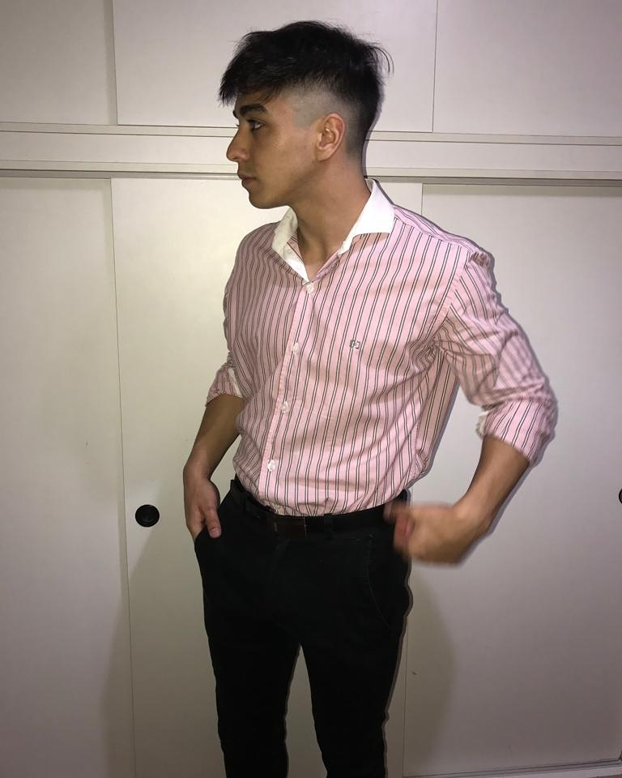

# Presentación

## Estudiante: _Facundo Cordoba_

Me presento: Yo soy facundo o Cufa para los amigos. Actualmente soy diseñador y maquetador web, manejo HTML, CSS y JS (básico, sigo en aprendizaje). Mi objetivo es terminar el stack de Front-end. 

Les dejo mi primer página, cufacoffe.ml fue una tarea de integración muy básica jajaja pero estoy contento.

Espero que podamos congeniar y llevarnos bien.

Cosas sobre mí:
 - Amo el diseño web
 - Sin música no puedo vivir
 - Mi color favorito es el azul
 - Me encanta hacer deporte en mis tiempos libres 

